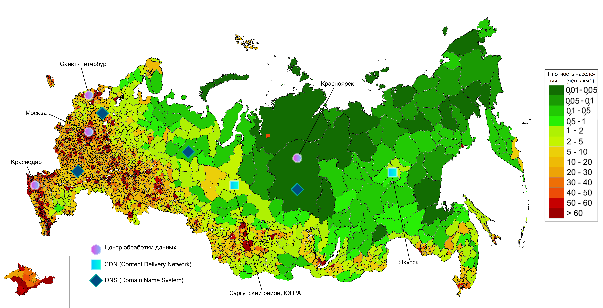

# Проектирование высоконагруженной системы Yandex Music
Курсовая работа в рамках 3-го семестра программы по WEB-разработке ОЦ VK x МГТУ им. Н.Э. Баумана по дисциплине "Проектирование высоконагруженных систем".

Работа выполнена в соответствии с [**заданием**](https://github.com/init/highload/blob/main/homework_architecture.md).

## Содержание
- [Тема, целевая аудитория и функционал](#тема-целевая-аудитория-и-функционал)
  - [Аудитория](#аудитория)
    - [Устройства использования сервиса](#с-каких-устройств-используют-сервис)
    - [Страны, которым доступна бесплатная версия приложения](#страны-которым-доступна-бесплатная-версия-приложения)
    - [География распространения сервиса](#география-распространения-сервиса)
  - [Функционал](#функционал)
    - [Ключевой функционал сервиса](#ключевой-функционал-сервиса)
    - [Ключевые продуктовые решения](#ключевые-продуктовые-решения)
- [Расчёт нагрузки](#расчёт-нагрузки)
  - [Продуктовые метрики](#продуктовые-метрики)
    - [DAU](#dau---10-млн-пользователей)
    - [MAU](#mau---25-млн-пользователей)
    - [Хранилище пользователя](#хранилище-пользователя)
    - [Хранилище метаданных медиа](#хранилище-метаданных-медиа)
    - [Типы медиа и их размер](#типы-медиа-и-их-размер)
    - [Прогназируемый прирост по памяти](#прогназируемый-прирост-по-памяти)
    - [Среднее количество действий пользователя по типам в день](#среднее-количество-действий-пользователя-по-типам-в-день)
  - [Технические метрики](#технические-метрики)
    - [Таблица расчета RPS на сервис](#таблица-расчета-rps-на-сервис)
    - [Таблица расчета сетевого трафика на ручки](#таблица-расчета-сетевого-трафика-на-ручки)
    - [Прогназируемый прирост запросов и сетевого трафика](#прогназируемый-прирост-запросов-и-сетевого-трафика)
- [Глобальная балансировка](#глобальная-балансировка)
- [Локальная балансировка](#локальная-балансировка)
- [Состав участников](#состав-участников-по-проектированию-высоконагруженной-системы)
- [Источники](#источники)

## Тема, целевая аудитория и функционал
В качестве высоконагруженной системы был выбран Yandex Music. 

Это ведущий в России музыкальный стриминговый сервис для поиска и прослушивания музыки с рекомендациями для каждого пользователя. Входит в состав Yandex Plus - единой подписки, открывающей мир множества фильмов и сериалов, миллионов песен и выгодного кэшбэка при пользовании различными сервисами компании.

### Аудитория 
+ В 2019 году количество слушателей Yandex Music составило `3 млн`.[^1] 
  Учитывая события последних 5 лет, оно кратно возросло с уходом зарубежных площадок, прогназируемое DAU - `от 6 до 10 млн`. 
+ MAU порядка `20-25 млн`. 
+ К концу 2022 года время прослушивания выросло `до 29ч/мес`.[^2] 
  Рост был связан с появлением рекомендательной системы "Моя волна". Будем считать время прослушивания неизменным, поскольку времени у людей больше не стало.
+ Время прослушивания в день: `29ч / 30д = 58 мин/д`.
+ Сервисом пользуются люди разных возрастов: от подростков и до взрослых людей (45+).
+ Школьники и студенты чаще заходят на сервис во второй половине дня, когда заканчиваются занятия. Пользователи старше 24 лет, похоже, больше всего слушают музыку на работе: те, кто моложе, активнее всего утром, а их старшие коллеги — в послеобеденные и вечерние часы.[^3]

#### С каких устройств используют сервис 

#### Страны, которым доступна бесплатная версия приложения
+ Россия
+ Беларусь
+ Казахстан
+ Азербайджан
+ Армения
+ Киргизия
+ Молдавия
+ Таджикистан
+ Туркменистан
+ Узбекистан
+ Грузия
+ Израиль

Остальным странам мира, за исключением некоторых, доступна только платная версия.

#### География распространения сервиса

### Функционал
#### Ключевой функционал сервиса
1) Авторизация.
2) Поиск треков, альбомов, исполнителей, плейлистов, подкастов, аудиокниг по названию.
3) Рекомендации для пользователя.
4) Загрузка исполнителями треков.
5) Монетизация.

#### Ключевые продуктовые решения
1) Создание пользователем коллекций музыки.
2) Составление чартов песен по категориям.
3) Авторизация в сервисе будет через OAuth2 посредством Yandex ID. 
4) Получение истории прослушиваний. 
5) Добавление песни в Избранное, получение списка избранных песен.
6) Полнотекстовый поиск.
7) Подборка музыки по настроению, языку исполнения, характеру, типу занятия пользователя. 
8) Подборка музыки, рекомендации пользователю на основе LLMs.

## Расчёт нагрузки
### Продуктовые метрики
#### MAU - `25 млн` пользователей

#### DAU - `10 млн` пользователей

#### Хранилище пользователя
| Хранимые данные                | Занимаемый размер    |
|--------------------------------|----------------------|
| Персональные данные, документы | 1 KB                 |
| Аватарка                       | 300 KB               |
| Связанные данные*              | 3 KB                 |
| Всего                          | 4.3 KB               | 

**Пояснение:** Связанные данные включают в себя историю прослушиваний, лайки, дизлайки, подписки и прочее.

Занимаемую память под пользователей можно вычислить по следующей формуле: 

$$
  memoryUserStorage = userCount \times memoryPerUser
$$

где:
+ memoryUserStorage - размер итоговой занимаемой памяти;
+ userCount - количество пользователей в системе;
+ memoryPerUser - размер памяти, занимаемой одним пользователем.  

Зная общее количество пользователей в сервисе - `25 млн`, получим размер хранилища пользователей: 

$$
  memoryUserStorage = \frac{25 \times 10^6 \times 4.3KB}{1024 \times 1024} = 102.52GB
$$

#### Хранилище метаданных медиа
| Хранимые данные   | Занимаемый размер    |
|-------------------|----------------------|
| Ссылка на медиа   | 0.1 KB               |
| Связанные данные* | 0.5 KB               |
| Всего             | 0.6 KB               | 

**Пояснение:** Связанные данные включают в себя метаданные о ресурсе (формат, расширение, алгоритм кодирования и тп).

Медиа касается как музыкальных треков, так и подкастов, аудиокниг, обложек, клипов и т.д. 
Yandex Music работает с большим количеством таких данных, поэтому мы будем хранить их в специально предназначенных для этого системах, которые нацелены на работу с такими форматами данных, а в базе данных будем хранить только ссылки на эти ресурсы, которые и будем возвращать клиенту. 

#### Типы медиа и их размер
| Тип              | Занимаемый размер    |
|------------------|----------------------|
| Музыкальный трек | 6.86 MB              |
| Подкаст          | 1029 MB              |
| Аудиокнига       | 1372 MB              | 
| Клипы            | 5.96 MB              | 
| Фото             | от 25 до 300 KB      | 

**Расчеты:** 
1) Музыкальный трек  

Размер аудиофайла может быть вычисле по формуле:

$$
  audioFileSize = bitrate \times audioDuration
$$

где:
+ audioFileSize - размер памяти, занимаемой треком;
+ bitrate - битрейт в kb/s;
+ audioDuration - продолжительность трека.  

Все треки высокого качества. Предположим, что битрейт был постоянный и равный `320 kb/s`. Средняя продолжительность трека - `3 минуты`, тогда получим средний размер трека:

$$
  audioFileSize = \frac{3 \times 60s \times 320kb/s}{8 \times 1024} = 6.86MB
$$

На сегодняшний день в Yandex Music доступно 74 миллиона музыкальных треков[^4]. 
Их суммарную занимаемую память можно рассчитать по формуле:

$$
  memoryTrackStorage = trackCount \times audioFileSize
$$

где:
+ memoryTrackStorage - размер итоговой занимаемой памяти;
+ trackCount - количество треков в системе;
+ audioFileSize - размер памяти, занимаемой одним треком.  

Получим: 

$$
  memoryTrackStorage = \frac{74 \times 10^6 \times 6.86MB}{1024 \times 1024} = 484.12TB
$$

2) Подкаст (аудио)

Аналогичный расчет. Формула нахождения размера эпизода подкаста:

$$
  podcastEpisodeSize = bitrate \times episodeDuration
$$

где:
+ podcastEpisodeSize - размер памяти, занимаемой эпизодом подкаста;
+ bitrate - битрейт в kb/s;
+ episodeDuration - продолжительность эпизода.  

Все аудиофайлы высокого качества. Предположим, что битрейт был постоянный и равный `320 kb/s`. Средняя продолжительность эпизода - `30 минут`[^5], тогда получим размер эпизода:

$$
  podcastEpisodeSize = \frac{30 \times 60s \times 320kb/s}{8 \times 1024} = 68.6MB
$$

По статистике Yandex, подкасты, которые опубликовали `больше 10` эпизодов, составляют `45%` всех подкастов.

Формула нахождения размера подкаста:

$$
  podcastSize = countEpisode \times podcastEpisodeSize
$$

где:
+ podcastSize - размер памяти, занимаемой подкастом;
+ countEpisode - количество эпизодов в подкасте;
+ podcastEpisodeSize - размер памяти, занимаемой эпизодом подкаста.  

Тогда получим средний размер памяти, занимаемой подкастом:

$$
  podcastSize = 68.6 \times 10 = 686 (MB)
$$

Оценим размер памяти, отводимой под хранение подкастов. Он будет вычисляться по формуле:

$$
  memoryPodcastStorage = countPodcast \times podcastSize
$$

где:
+ memoryPodcastStorage - размер памяти, занимаемой подкастами;
+ countPodcast - количество подкастов в сервисе;
+ podcastSize - размер памяти, занимаемой подкастом.  

В 2021 в каталоге Yandex Music было 11,5 тысячи подкастов. Количество подкастов тогда росло быстро (по 500 новых проектов ежемесячно)[^5], но сейчас рост явно уменьшился, поэтому предположим, что в 2022-2024 прирост подкастов в среднем был по 150 новых проектов в месяц. 

Тогда суммарный объем памяти, занимаемый подкастами, равен:

$$
  memoryPodcastStorage = \frac{(11500 + 3 \times 12 \times 150) \times 686MB}{1024 \times 1024} = 11.06TB
$$ 

3) Аудиокнига

Рассчитаем размер памяти под главу аудиокниги по формуле:

$$
  audioBookChapterSize = bitrate \times audioBookChapterDuration
$$

где:
+ audioBookChapterSize - размер памяти, занимаемой главой аудиокниги;
+ bitrate - битрейт в kb/s;
+ audioBookChapterDuration - продолжительность главы аудиокниги.  

Все аудиозаписи высокого качества. Предположим, что битрейт был постоянный и равный `320 kb/s`. Продолжительность главы аудиокниги должна быть от `10 минут` (это общая рекомендация для издателей), возьмем среднее значение в `15 минут`. Получается, что размер главы аудиокниги равен:

$$
  audioBookChapterSize = \frac{15 \times 60 \times 320kb/s}{8 \times 1024} = 34.3MB
$$

Формула получения размера аудиокниги:

$$
  audioBookSize = chapterCount \times audioBookChapterSize
$$

где:
+ audioBookSize - размер памяти, занимаемой аудиокнигой;
+ chapterCount - количество глав в аудиокниге;
+ audioBookChapterSize - размер главы в аудиокниге.  

Сложно сказать, сколько в среднем глав имеет книга, но пусть это будет 40 глав (на самом деле это не только главы, но и подтемы, которые также транслируются в отдельном плеере). Таким образом, размер аудиокниги равен:

$$
  audioBookSize = 40 \times 34.3MB = 1372MB
$$

В пресс-службе компании заявили, что количество аудиокниг в Yandex Music выросло в два раза[^6], до `15 тыс`, на момент 2022 года. Пусть количество аудиокниг за 2 года выросло в 1.5 раза, что составило `22.5 тыс`. 

Оценим размер памяти, отводимой под хранение аудиокниг. Он будет вычисляться по формуле:

$$
  memoryAudioBookStorage = countAudioBook \times audioBookSize
$$

где:
+ memoryAudioBookStorage - размер памяти, занимаемой аудиокнигами;
+ countAudioBook - количество аудиокниг в сервисе;
+ audioBookSize - размер памяти, занимаемой аудиокнигой.  

Тогда объем памяти составит:

$$
  memoryAudioBookStorage = \frac{22500 \times 1372MB}{1024 \times 1024} = 11.06TB
$$

4) Клип

Клип - яркий и короткий видеоролик, который крутится в плеере при прослушивании песни популярного исполнителя и не только. 

Формула расчета размера памяти, отводимой для клипа:

$$
  clipSize = bitrate \times clipDuration
$$

где:
+ clipSize - размер памяти, занимаемой клипом;
+ bitrate - битрейт в kb/s;
+ clipDuration - продолжительность клипа.  

Средняя продолжительность такого клипа примерно `10 секунд`. Рассчитаем размер, предположив, что битрейт записи видео был `5 mb/s`. Итоговый размер клипа:

$$
  clipSize = \frac{5mb/s \times 10s}{8} = 6.25MB
$$

Количество клипов очень мало, поэтому мы пренебрегаем занимаемой памятью.

5) Фото

Фото есть у каждого медиа ресурса (трека, подкаста, аудиокниги и тд). У него может быть несколько изображений в разных разрешениях. Ограничимся 2-мя: маленьким и средним. 

Дополнительно учтем: Пусть каждый третий пользователь создает собственный плейлист и ставит фотографию на него, тогда количество плейлистов будет `8.3 млн`.

Формула подсчета суммарного количества объекта медиа типа:

$$
  countMediaObjects = countUser + countTrack + countPlaylist + countPodcast + countAudioBook
$$

где:
+ countMediaObjects - количество медиа объектов;
+ countUser - количество пользователей в сервисе;
+ countTrack - количество трэков в сервисе;
+ countPlaylist - количество плейлистов в сервисе;
+ countPodcast - количество подкастов в сервисе;  
+ countAudioBook - количество аудиокниг в сервисе.  

Если посчитаем, то получим:

$$
  countMediaObjects = 25000000 + 79000000 + 8300000 + 16900 + 22500 = 112339400 
$$

Не забываем, что у каждого объекта два изображения: одно с маленьким разрешением, другое со средним.

Формула получения занимаемой памяти под изображения:

$$
  memoryImageStorage = countMediaObjects \times (sizeOfLowResolutionImage + sizeOfHighResolutionImage)
$$

где:
+ memoryImageStorage - размер памяти, занимаемой хранилищем изображений;
+ countMediaObjects - количество медиа объектов в сервисе;
+ sizeOfLowResolutionImage - размер изображения с низким разрешением;
+ sizeOfHighResolutionImage - размер изображения с высоким разрешением. 

Изображение в среднем разрешении имеет размер в `300 KB`, а в малом - `50 KB`.
Итого, занимаемая память под изображения равна:

$$
  memoryImageStorage = \frac{112339400 \times (300KB + 50KB)}{1024 \times 1024 \times 1024} = 36.62TB
$$

Вернемся к таблице метаданных медиа. Вычислим размер памяти, занимаемой хранилищем, по формуле:

$$
  memoryMediaMetadataStorage = countMediaObjects \times mediaMetaData
$$

где:
+ memoryMediaMetadataStorage - размер памяти, занимаемой хранилищем метаданных медиа файлов;
+ countMediaObjects - количество медиа объектов в сервисе;
+ mediaMetaData - размер метаданных.

В системе примерно `112339400` медиа файлов, тогда средний размер хранилища матаданных медиа будет:

$$
  memoryMediaMetadataStorage = \frac{112339400 \times 0.6KB}{1024 \times 1024} = 64.28GB
$$

#### Прогназируемый прирост по памяти
Рост количества сущностей:
  + В стриминговый сервис загружают в среднем `55 тыс` новых релизов в неделю,[^7] тогда в день это будет `7.86 тыс` треков.
  + Будет считать, что аудитория сервиса растет постоянно. В 2021 году аудитория сервиса была 20 млн. пользователей.[^8]
  Найдем среднее количество новых пользователей: `(25 - 20)/4 = 1.25 млн.`. Объем хранилища пользователя прямо пропорционален количеству пользователей. 
  + В среднем 150 подкастов в месяц.
  + Пусть ежегодный рост количества книг от общего объема составляет 10%, что вполне реально, поскольку в 2022 году рост составил 40%. 
  + Количество фото прямо пропорционально количеству медиа объектов в сервисе.

##### Треки

$$
  requiredMemory = countTrack \times daysInTheYear \times sizeOfTrack
$$

где: 
  + requiredMemory - дополнительно требуемая память;
  + countTrack - количество новых треков;
  + daysInTheYear - количество дней в году;
  + sizeOfTrack - размер одного трека.

$$
  requiredMemory = 7860 \times 365 \times 6.86MB = 18.77TB
$$

Количество новых треков в год: `2868900`.

##### Пользователи

$$
  requiredMemory = countNewUser \times sizeOfUserStorage
$$

где: 
  + countNewUser - количество новых пользователей;
  + sizeOfUserStorage - размер хранилища пользователя.

$$
  requiredMemory = 1.25 \times 10^6 \times 4.3KB = 5.13GB
$$

Количество новых пользователей в год: `1250000`.

##### Подкасты

$$
  requiredMemory = countNewPodcastPerMonth \times monthInTheYear \times sizeOfPodcast
$$

где: 
  + countNewPodcast - количество новых подкастов в месяц;
  + monthInTheYear - количество месяцев в году;
  + sizeOfPodcast - размер подкаста.

$$
  requiredMemory = 150 \times 12 \times 1029MB = 1.77TB
$$

Количество новых подкастов в год: `1800`.

##### Аудиокниги

$$
  requiredMemory = currentNumberOfBooks \times (growthRate - 1) \times sizeOfBook
$$

где: 
  + currentNumberOfBooks - тукущее количество аудиокниг;
  + sizeOfBook - размер аудиокниги.

$$
  requiredMemory = 22500 \times (1.1 - 1) \times 1372MB = 2.94TB
$$

Количество новых аудиокниг в год: `2250`.

##### Картинки

$$
  countNewObjects = countNewTracks + countNewUsers + countNewPodcasts + countNewBooks
$$

где: 
  + countNewObjects - количество новых объектов за год;
  + countNewTracks - количество новых треков.
  + countNewUsers - количество новых пользователей.
  + countNewPodcasts - количество новых подкастов.
  + countNewBooks - количество новых аудиокниг.

$$
  countNewObjects = 2868900 + 1250000 + 1800 + 2250 = 4122950
$$

У этих объекто есть как фотография размером `300KB`, так и размером поменьше `25KB`, тогда требуемая память под хранение равна:

$$
  requiredMemory = \frac{4122950 \times (300KB + 25KB)}{1024 \times 1024 \times 1024} = 1.25TB
$$

**Тогда итоговый прирост в памяти каждый год примерно будет:**

$$
  deltaMemory = 18.77TB + 5.13GB + 1.77TB + 2.94TB + 1.25TB = 24.74TB
$$  

#### Среднее количество действий пользователя по типам в день  

| Действие                                | Запрос/день на одного пользователя   |
|-----------------------------------------|--------------------------------------|
| Авторизация                             | 0,032 (1 в месяц)                    |
| Донаты исполнителям                     | 0.003 (1 в год)                      |
| Создание коллекций треков               | 0,032                                |
| Получение главной страницы              | 3                                    |
| Получение списка избранных песен        | 5                                    |
| Получение плейлиста                     | 2                                    |
| Получение альбома                       | 2                                    |
| Поиск треков                            | 3                                    |
| Поиск треков                            | 3                                    |
| Поиск альбомов                          | 3                                    |
| Поиск исполнителей                      | 3                                    |
| Поиск плейлистов                        | 3                                    |
| Поиск подкастов                         | 3                                    |
| Поиск аудиокниг по названию             | 3                                    |
| Стриминг избранного трека               | 10                                   |
| Получение истории прослушиваний         | 1                                    |
| Добавление песни в избранное            | 2                                    |
| Прослушивание рекомендации 'Моя волна'  | 10                                   |

#### Дополнительно

| Действие                                | Количество загрузок в день |
|-----------------------------------------|----------------------------|
| Загрузка трека исполнителем             | 7860                       |

Пользователь авторизовывается в Yandex Music используя протокол OAuth2.
Пусть время жизни refresh_token - `30 дней`. 
Количество донатов исполнителю в среднем `1 раз/год`. 
Создание коллекции треков в среднем `1 раз/месяц`.

**Представим стандартный кейс использования музыкального сервиса за целый день одним пользователем:**
+ Получение главной страницы, на которой рекомендации (в среднем `3 раза/день`): 
  + Список релизов - 8 картинок по `50KB`.
  + Список концертов для пользователя - 8 картинок по `50KB`.
  + 3 списка по жанру по 8 картинок в каждом - суммарно 24 по `25KB`.
  + Дополнительные картинки - около 10 по `25KB`.
+ Открытие списка избранных песен (в среднем `5 раз/день`): 
  + Подгрузка части списка (infinite scroll) - 20 названий песни и столько же картинок по `25KB`, в среднем избранных песен 100. То есть в среднем открытие списка будет вызывать 5 запросов.
+ Открытие плейлиста (в среднем `2 раз/день`):
  + Подгрузка части списка (infinite scroll) - 20 названий песни и столько же картинок по `25KB`, в среднем песен плейлиста 40.
+ Открытие альбома (в среднем `2 раз/день`):
  + Подгрузка части списка (infinite scroll) - 15 названий песни и столько же картинок по `25KB`, в среднем песен альбома 40.
+ Поиск медиа - трек, плейлист, подкаст, аудиокниги - (в среднем `3 раза/день`):
  + Отображение лучших результатов поиска - в среднем 20 названий и картинок по `50KB`.
  + Отображение списка исполнителей - в среднем 2 названия и картинки по `50KB`.
  + Отображение альбомов - в среднем 5 названий и картинок по `50KB`.
  + Отображение плейлистов - в среднем 5 названий и картинок по `50KB`.
+ Стриминг избранного трека (в среднем `10 раз/день`):
  + Загрузка трека - в среднем пользователь слушает музыку 58 мин/день. Средняя продолжительность одного трека 3 мин, пусть пользователь слушает рекомендацию 'Моя волна' и избранные треки в отношении 1:1, следовательно количество загружаемых треков `58/(2 * 3) = 9.6`, округлим до `10`. 
+ Получение истории прослушиваний (в среднем `1 раз/день`): 
  + Подгрузка части списка (infinite scroll) - 15 названий песни и столько же картинок по `25KB`. История прослушиваний приходит за 2 недели, поэтому количество треков в среднем равно `10 * 14 = 140`. 
+ Добавление песни в избранное (в среднем `2 раз/день`).
+ Среднее прослушивание рекомендации 'Моя волна' (в среднем `10 раз/день`):
  + В среднем это `29 минут`. Получим, что пользователь слушает стриминговую рекомендацию столько же, сколько и избранные треки. 
+ Загрузка трека исполнителями (в среднем `7860 раз/день`):
  + В стриминговый сервис загружают в среднем `55 тыс` новых релизов в неделю, тогда в день это будет `7.86 тыс` треков.

### Технические метрики 
Возьмём увеличение нагрузки в пиках до значений, в `2.5 раза` превышающих стандартные. 
Зная среднее количество действий пользователя по типам в день, рассчитаем **RPS**.

#### Таблица расчета RPS на сервис

| Действие                                | RPS         | Пиковое значение RPS |
|-----------------------------------------|-------------|----------------------|
| Авторизация                             | 3.7         | 9.25                 |
| Донаты исполнителям                     | 0.3         | 0.75                 |
| Создание коллекций треков               | 3.7         | 9.25                 |
| Получение главной страницы              | 347         | 867.5                |
| Получение списка избранных песен        | 2895        | 7237.5               |
| Получение плейлиста                     | 464         | 1160                 |
| Получение альбома                       | 464         | 1160                 |
| Поиск треков                            | 347         | 867                  |
| Поиск альбомов                          | 347         | 867                  |
| Поиск исполнителей                      | 347         | 867                  |
| Поиск плейлистов                        | 347         | 867                  |
| Поиск подкастов                         | 347         | 867                  |
| Поиск аудиокниг по названию             | 347         | 867                  |
| Стриминг избранного трека               | 1157        | 2892                 |
| Получение истории прослушиваний         | 116         | 290                  |
| Добавление песни в избранное            | 232         | 580                  |
| Прослушивание рекомендации 'Моя волна'  | 1157        | 2892                 |
| Загрузка трека исполнителем             | 0.09        | 0.225                |
| **Суммарно**                            | **8921.79** | **22304.25**         |

**Подсчеты**

Для каждой ручки будет пользоваться формулой:

$$
  handlerRPS = \frac{userDayRequest \times DAU}{86400}
$$

где:
+ handlerRPS - количество запросов в секунду у ручки на беке;
+ userDayRequest - количество запросов пользователя в день на определенное действие;
+ DAU (daily active users) - количество уникальных пользователей, взаимодействующих с сервисом в течение 24-часового окна активности;

**Авторизация**

$$
  handlerRPS = \frac{0.032 \times 10 \times 10^6}{86400} = 3.7 RPS
$$

**Донаты исполнителям**

$$
  handlerRPS = \frac{0.003 \times 10 \times 10^6}{86400} = 0.3 RPS
$$

**Создание коллекций треков**

$$
  handlerRPS = \frac{0.032 \times 10 \times 10^6}{86400} = 3.7 RPS
$$

**Получение главной страницы**

$$
  handlerRPS = \frac{3 \times 10 \times 10^6}{86400} = 347 RPS
$$

**Получение списка избранных песен**

$$
  handlerRPS = \frac{5 \times 5 \times 10 \times 10^6}{86400} = 2895 RPS
$$

**Получение плейлиста**

$$
  handlerRPS = \frac{2  \times 2 \times 10 \times 10^6}{86400} = 464 RPS
$$

**Получение альбома**

$$
  handlerRPS = \frac{2 \times 2 \times 10 \times 10^6}{86400} = 464 RPS
$$

**Поиск треков**

$$
  handlerRPS = \frac{3 \times 10 \times 10^6}{86400} = 347 RPS
$$

**Поиск альбомов**

$$
  handlerRPS = \frac{3 \times 10 \times 10^6}{86400} = 347 RPS
$$

**Поиск исполнителей**

$$
  handlerRPS = \frac{3 \times 10 \times 10^6}{86400} = 347 RPS
$$

**Поиск плейлистов**

$$
  handlerRPS = \frac{3 \times 10 \times 10^6}{86400} = 347 RPS
$$

**Поиск подкастов**

$$
  handlerRPS = \frac{3 \times 10 \times 10^6}{86400} = 347 RPS
$$

**Поиск аудиокниг по названию**

$$
  handlerRPS = \frac{3 \times 10 \times 10^6}{86400} = 347 RPS
$$

**Стриминг избранного трека**

$$
  handlerRPS = \frac{10 \times 10 \times 10^6}{86400} = 1157 RPS
$$

**Получение истории прослушиваний**

$$
  handlerRPS = \frac{1 \times 10 \times 10^6}{86400} = 116 RPS
$$

**Добавление песни в избранное**

$$
  handlerRPS = \frac{2 \times 10 \times 10^6}{86400} = 232 RPS
$$

**Прослушивание рекомендации 'Моя волна'**

$$
  handlerRPS = \frac{10 \times 10 \times 10^6}{86400} = 1157 RPS
$$

**Загрузка трека исполнителем**

$$
  handlerRPS = \frac{7860}{86400} = 0.09 RPS
$$

**Суммарный RPS = 8921.79 RPS**

#### Таблица расчета сетевого трафика на ручки
Зная DAU, посчитаем количество данных, передаваемых по сети.
Расчеты проведем для запросов, работающих с медиа контентом, потому что там передаются значительные объём данных.

| Действие                                | Объём передаваемых данных GB/s | Пиковое значение GB/s |
|-----------------------------------------|--------------------------------|-----------------------|
| Создание коллекций треков               | 0.0012                         | 0.0030                |
| Получение главной страницы              | 0.544                          | 1.36                  |
| Получение списка избранных песен        | 1.39                           | 3.475                 |
| Получение плейлиста                     | 0.11                           | 0.275                 |
| Получение альбома                       | 0.11                           | 0.275                 |
| Поиск треков                            | 0.54                           | 1.35                  |
| Поиск альбомов                          | 0.54                           | 1.35                  |
| Поиск исполнителей                      | 0.54                           | 1.35                  |
| Поиск плейлистов                        | 0.54                           | 1.35                  |
| Поиск подкастов                         | 0.54                           | 1.35                  |
| Поиск аудиокниг по названию             | 0.54                           | 1.35                  |
| Стриминг аудио                          | 15.394                         | 38.485                |
| Получение истории прослушиваний         | 0.382                          | 0.955                 |
| Загрузка трека исполнителем             | 0.0006                         | 0.0015                |
| **Суммарно**                            | **19.0788**                    | **47.697**            |

**Подсчеты**

Для каждой ручки будет пользоваться формулой:

$$
  handlerTraffic = handlerDayRequest \times handlerDataLoad
$$

где:
+ handlerTraffic - объем передаваемых по сети данных у ручки в секунду;
+ handlerRPS - количество запросов пользователя в день на определенное действие;
+ handlerDataLoad - объем данных, загружаемых одним запросом;

**Создание коллекций треков**

Найдем `handlerDataLoad`. При создании пользователь указывает название коллекции и добавляет ей фотографию среднего размера,
пусть ее размер будет `300KB`. Это и составляет основной размер передаваемых данных.

$$
  handlerTraffic = \frac{0.032 \times 300KB}{1024 \times 1024} = 9.2 \times 10^-6GB/day
$$

$$
  resultHandlerTraffic = handlerTraffic * DAU
$$

$$
  resultHandlerTraffic = \frac{9.2 \times 10^-6 \times 10 \times 10^6}{86400} = 0.0012GB/sec
$$

**Получение главной страницы**

Найдем `handlerDataLoad`. В стандартном кейсе использования была описана структура страницы, посчитаем суммарное количество медиа.

$$
  handlerDataLoad = 2 \times 8 \times 50KB + 24 \times 25KB + 10 \times 25KB = 1650KB
$$

$$
  handlerTraffic = \frac{3 \times 1650KB}{1024 \times 1024} = 0.0047GB/day
$$

$$
  resultHandlerTraffic = \frac{0.0047 \times 10 \times 10^6}{86400} = 0.544GB/sec
$$

**Получение списка избранных песен**

Найдем `handlerDataLoad`. Загрузка 20 названий песен с картинками по `25KB`:

$$
  handlerDataLoad = 20 \times 25KB = 500KB
$$

$$
  handlerTraffic = \frac{5 \times 5 \times 500KB}{1024 \times 1024} = 0.012GB/day
$$

$$
  resultHandlerTraffic = \frac{0.012 \times 10 \times 10^6}{86400} = 1.39GB/sec
$$

**Получение плейлиста, альбома**

Найдем `handlerDataLoad`. Загрузка 20 названий песен с картинками по `25KB`:

$$
  handlerDataLoad = 20 \times 25KB = 500KB
$$

$$
  handlerTraffic = \frac{2 \times 500KB}{1024 \times 1024} = 0.00095GB/day
$$

**Суммарный трафик на получение плейлиста, альбома:** 

$$
  sumHandlerTraffic = 2 * 0.00095 = 0.0019 GB/day
$$

$$
  resultHandlerTraffic = \frac{0.00095 \times 10 \times 10^6}{86400} = 0.22GB/sec
$$

**Поиск треков, альбомов, исполнителей, плейлистов, подкастов, аудиокниг по названию**

Из чего состоит поиск:
  + Отображение лучших результатов поиска - в среднем 20 названий и картинок по `50KB`.
  + Отображение списка исполнителей - в среднем 2 названия и картинки по `50KB`.
  + Отображение альбомов - в среднем 5 названий и картинок по `50KB`.
  + Отображение плейлистов - в среднем 5 названий и картинок по `50KB`.

$$
  handlerDataLoad = 32 \times 50KB = 1600KB
$$

$$
  handlerTraffic = \frac{3 \times 1600KB}{1024 \times 1024} = 0.0045GB/day
$$

**Суммарный трафик на поиск медиа:**

$$
  sumHandlersDataLoad = 0.0045GB/sec \times 6 = 0.027GB/day
$$

$$
  resultHandlerTraffic = \frac{0.027 \times 10 \times 10^6}{86400} = 3.125GB/sec
$$

**Стриминг избранного трека и рекомендации 'Моя волна'**

Пользователь слушает в день `58 минут`, посчитаем объем:

$$
  handlerTraffic = \frac{320kb/sec * 58 * 60}{8 * 1024} = 0.133GB/day
$$

$$
  resultHandlerTraffic = \frac{0.133 \times 10 \times 10^6}{86400} = 15.394GB/sec
$$

**Получение истории прослушиваний**

Загрузка 140 названий песен с картинками по `25KB`.

$$
  handlerDataLoad = 140 \times 25KB = 3500KB
$$

$$
  handlerTraffic = \frac{1 \times 3500KB}{1024 \times 1024} = 0.0033GB/day
$$

$$
  resultHandlerTraffic = \frac{0.0033 \times 10 \times 10^6}{86400} = 0.382GB/sec
$$

**Загрузка треков исполнителями**

Загрузка `7860` треков в сутки со средней длительностью в `3 минуты`. 

$$
  handlerDataLoad = \frac{7860 \times 3 \times 60s \times 320kb/sec}{8} = 54GB
$$

$$
  resultHandlerTraffic = \frac{54GB}{86400} = 0.382GB/sec = 0.0006GB/sec
$$

**Суммарный объем трафика на сервис = 19.0788 GB/sec.**

**Итоговая сводная таблица технических метрик**
|                    | RPS    | Пиковый RPS | Нагрузка на сеть GB/sec | Пиковая нагрузка на сеть GB/sec |
|--------------------|--------|-------------|-------------------------|---------------------------------|
| Результат          | 8921.7 | 22304.25    | 19.0788                 | 47.697                          |

#### Прогназируемый прирост запросов и сетевого трафика
Будет считать, что аудитория сервиса растет и будет расти линейно. В 2019 году, как упоминалось ранее, DAU было порядка `3 млн.`, сейчас аудитория порядка `10 млн. в день`.
За 5 лет прирост составил 7 млн. пользователей, то есть `1.4 млн. пользователей/год`. Объем нагрузки на сеть и RPS прямо пропорциональны количеству пользователей, поэтому:

$$
  deltaRPS = 8921.7 \times \frac{1.4 \times 10 \times 10^6}{25 \times 10 \times 10^6} = 499.6 RPS
$$

$$
  deltaNetworkData = 19.0788 \times \frac{1.4 \times 10 \times 10^6}{25 \times 10 \times 10^6} = 1.07 GB/sec
$$

## Глобальная балансировка 
Целевая аудитория сервиса расположениа в России и странах СНГ. Взглянем на карту плотности населения Росиии (на ней обозначены местоположения ЦОДов и CDNов):

Исходя из неё, расположим наши ЦОДы в основных крупных городах, а именно:
+ Москва
+ Санкт-Петербург
+ Краснодар
+ Красноярск

Основый сетевой трафик исходит из центра и юга России, поэтому там большее количество ЦОДов. Для обслуживания Зауралья, Дальнего Востока также выделили один ЦОД, но для скорости работы добавили CDN.

CDN:
+ Сургутский район, Ханты—Мансийского автономного округа
+ Якутск

## Локальная балансировка 

## Состав участников по проектированию высоконагруженной системы
[Лобанов Иван (Я)](https://t.me/cantylv) — Проектировщик высоконагруженной системы. 

[Павел Шипилов](https://vk.com/ytmans) — Преподаватель.

## Источники
[^1]: [Число подписчиков «Яндекс.Музыки» выросло в три раза за полтора года и достигло 3 млн.](https://vc.ru/media/96460-chislo-podpischikov-yandeksmuzyki-vyroslo-v-tri-raza-za-poltora-goda-i-dostiglo-3-mln)

[^2]: [Яндекс.Музыка представил статистический отчет о предпочтениях пользователей в 2022 году](https://www.rma.ru/news/64709/)

[^3]: [У каждого поколения — своя музыка. Или нет?](https://yandex.ru/company/researches/2016/ya_music_and_age)

[^4]: [Transparency Report | Yandex](https://yandex.ru/support/music/ru/rules/transparencyreport)

[^5]: [Подкасты России](https://yandex.ru/company/researches/2021/podcasts)

[^6]: [«Яндекс Музыка» назвала самые популярные аудиокниги на платформе](https://www.kommersant.ru/doc/5706414)

[^7]: ["Яндекс Музыка" создала технологию по поиску слушателей для музыкантов-новичков](https://tass.ru/obschestvo/21305911)

[^8]: [Article Yandex](https://support.the-source.eu/kb/a136/yandex.aspx)