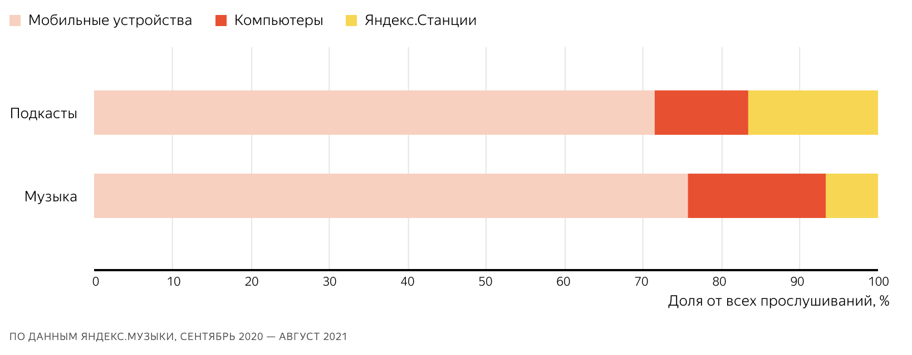

# Проектирование высоконагруженной системы Yandex Music
Курсовая работа в рамках 3-го семестра программы по WEB-разработке ОЦ VK x МГТУ им. Н.Э. Баумана по дисциплине "Проектирование высоконагруженных систем".

Работа выполнена в соответствии с [**заданием**](https://github.com/init/highload/blob/main/homework_architecture.md).

## Содержание
- [Тема, целевая аудитория и функционал](#тема-целевая-аудитория-и-функционал)
- [Расчёт нагрузки](#расчёт-нагрузки)
- [Состав участников](#состав-участников-по-проектированию-высоконагруженной-системы)
- [Источники](#источники)

## Тема, целевая аудитория и функционал
В качестве высоконагруженной системы был выбран Yandex Music. 

Это ведущий в России музыкальный стриминговый сервис для поиска и прослушивания музыки с рекомендациями для каждого пользователя. Входит в состав Yandex Plus - единой подписки, открывающей мир множества фильмов и сериалов, миллионов песен и выгодного кэшбэка при пользовании различными сервисами компании.

### Аудитория 
+ В 2019 году количество слушателей Yandex Music составило `3 млн`.[^1] 
  Учитывая события последних 5 лет, оно кратно возросло с уходом зарубежных площадок, прогназируемое DAU - `от 6 до 10 млн`. 
+ MAU порядка `20-25 млн`. 
+ К концу 2022 года время прослушивания выросло `до 29ч/мес`.[^2] 
  Рост был связан с появлением рекомендательной системы "Моя волна". Будем считать время прослушивания неизменным, поскольку времени у людей больше не стало.
+ Время прослушивания в день: `29ч / 30д = 58 мин/д`.
+ Сервисом пользуются люди разных возрастов: от подростков и до взрослых людей (45+).
+ Школьники и студенты чаще заходят на сервис во второй половине дня, когда заканчиваются занятия. Пользователи старше 24 лет, похоже, больше всего слушают музыку на работе: те, кто моложе, активнее всего утром, а их старшие коллеги — в послеобеденные и вечерние часы.[^3]

#### С каких устройств используют сервис 

#### Страны, которым доступна бесплатная версия приложения
+ Россия
+ Беларусь
+ Казахстан
+ Азербайджан
+ Армения
+ Киргизия
+ Молдавия
+ Таджикистан
+ Туркменистан
+ Узбекистан
+ Грузия
+ Израиль

Остальным странам мира, за исключением некоторых, доступна только платная версия.

#### География распространения сервиса

### Функционал
#### Ключевой функционал сервиса
1) Авторизация.
2) Поиск треков, альбомов, исполнителей, плейлистов, подкастов, аудиокниг по названию.
3) Рекомендации для пользователя.
4) Загрузка исполнителями треков.
5) Монетизация.

#### Ключевые продуктовые решения
1) Создание пользователем коллекций музыки.
2) Составление чартов песен по категориям.
3) Авторизация в сервисе будет через OAuth2 посредством Yandex ID. 
4) Получение истории прослушиваний. 
5) Добавление песни в Избранное, получение списка избранных песен.
6) Полнотекстовый поиск.
7) Подборка музыки по настроению, языку исполнения, характеру, типу занятия пользователя. 
8) Подборка музыки, рекомендации пользователю на основе LLMs.

## Расчёт нагрузки
### Продуктовые метрики
**MAU** - `25 млн` пользователей

**DAU** - `10 млн` пользователей

#### Хранилище пользователя
| Хранимые данные                | Занимаемый размер    |
|--------------------------------|----------------------|
| Персональные данные, документы | 1 KB                 |
| Аватарка                       | 300 KB               |
| Связанные данные*              | 3 KB                 |
| Всего                          | 4.3 KB               | 

**Пояснение:** Связанные данные включают в себя историю прослушиваний, лайки, дизлайки, подписки и прочее.

Занимаемую память под пользователей можно вычислить по следующей формуле: 

$$
  memoryUserStorage = userCount \times memoryPerUser
$$

где:
+ memoryUserStorage - размер итоговой занимаемой памяти;
+ userCount - количество пользователей в системе;
+ memoryPerUser - размер памяти, занимаемой одним пользователем.  

Зная общее количество пользователей в сервисе - `25 млн`, получим размер хранилища пользователей: 

$$
  memoryUserStorage = \frac{25 \times 10^6 \times 4.3KB}{1024 \times 1024} = 102.52GB
$$

#### Хранилище метаданных медиа
| Хранимые данные   | Занимаемый размер    |
|-------------------|----------------------|
| Ссылка на медиа   | 0.1 KB               |
| Связанные данные* | 0.5 KB               |
| Всего             | 0.6 KB               | 

**Пояснение:** Связанные данные включают в себя метаданные о ресурсе (формат, расширение, алгоритм кодирования и тп).

Медиа касается как музыкальных треков, так и подкастов, аудиокниг, обложек, клипов и т.д. 
Yandex Music работает с большим количеством таких данных, поэтому мы будем хранить их в специально предназначенных для этого системах, которые нацелены на работу с такими форматами данных, а в базе данных будем хранить только ссылки на эти ресурсы, которые и будем возвращать клиенту. 

#### Типы медиа и их размер
| Тип              | Занимаемый размер    |
|------------------|----------------------|
| Музыкальный трек | 6.86 MB              |
| Подкаст          | 1029 MB              |
| Аудиокнига       | 1372 MB              | 
| Клипы            | 5.96 MB              | 
| Фото             | 0.6 KB               | 

**Расчеты:** 
1) Музыкальный трек  

Размер аудиофайла может быть вычисле по формуле:

$$
  audioFileSize = bitrate \times audioDuration
$$

где:
+ audioFileSize - размер памяти, занимаемой треком;
+ bitrate - битрейт в kb/s;
+ audioDuration - продолжительность трека.  

Все треки высокого качества. Предположим, что битрейт был постоянный и равный `320 kb/s`. Средняя продолжительность трека - `3 минуты`, тогда получим средний размер трека:

$$
  audioFileSize = \frac{3 \times 60s \times 320kb/s}{8 \times 1024} = 6.86MB
$$

На сегодняшний день в Yandex Music доступно 74 миллиона музыкальных треков[^4]. 
Их суммарную занимаемую память можно рассчитать по формуле:

$$
  memoryTrackStorage = trackCount \times audioFileSize
$$

где:
+ memoryTrackStorage - размер итоговой занимаемой памяти;
+ trackCount - количество треков в системе;
+ audioFileSize - размер памяти, занимаемой одним треком.  

Получим: 

$$
  memoryTrackStorage = \frac{74 \times 10^6 \times 6.86MB}{1024 \times 1024} = 484.12TB
$$

2) Подкаст (аудио)

Аналогичный расчет. Формула нахождения размера эпизода подкаста:

$$
  podcastEpisodeSize = bitrate \times episodeDuration
$$

где:
+ podcastEpisodeSize - размер памяти, занимаемой эпизодом подкаста;
+ bitrate - битрейт в kb/s;
+ episodeDuration - продолжительность эпизода.  

Все аудиофайлы высокого качества. Предположим, что битрейт был постоянный и равный `320 kb/s`. Средняя продолжительность эпизода - `30 минут`[^5], тогда получим размер эпизода:

$$
  podcastEpisodeSize = \frac{30 \times 60s \times 320kb/s}{8 \times 1024} = 68.6MB
$$

По статистике Yandex, подкасты, которые опубликовали `больше 10` эпизодов, составляют `45%` всех подкастов.

Формула нахождения размера подкаста:

$$
  podcastSize = countEpisode \times podcastEpisodeSize
$$

где:
+ podcastSize - размер памяти, занимаемой подкастом;
+ countEpisode - количество эпизодов в подкасте;
+ podcastEpisodeSize - размер памяти, занимаемой эпизодом подкаста.  

Тогда получим средний размер памяти, занимаемой подкастом:

$$
  podcastSize = 68.6 \times 10 = 686 (MB)
$$

Оценим размер памяти, отводимой под хранение подкастов. Он будет вычисляться по формуле:

$$
  memoryPodcastStorage = countPodcast \times podcastSize
$$

где:
+ memoryPodcastStorage - размер памяти, занимаемой подкастами;
+ countPodcast - количество подкастов в сервисе;
+ podcastSize - размер памяти, занимаемой подкастом.  

В 2021 в каталоге Yandex Music было 11,5 тысячи подкастов. Количество подкастов тогда росло быстро (по 500 новых проектов ежемесячно), но сейчас рост явно уменьшился, поэтому предположим, что в 2022-2024 прирост подкастов в среднем был по 150 новых проектов в месяц. 

Тогда суммарный объем памяти, занимаемый подкастами, равен:

$$
  memoryPodcastStorage = \frac{(11500 + 3 \times 12 \times 150) \times 686MB}{1024 \times 1024} = 11.06TB
$$ 

3) Аудиокнига

Рассчитаем размер памяти под главу аудиокниги по формуле:

$$
  audioBookChapterSize = bitrate \times audioBookChapterDuration
$$

где:
+ audioBookChapterSize - размер памяти, занимаемой главой аудиокниги;
+ bitrate - битрейт в kb/s;
+ audioBookChapterDuration - продолжительность главы аудиокниги.  

Все аудиозаписи высокого качества. Предположим, что битрейт был постоянный и равный `320 kb/s`. Продолжительность главы аудиокниги должна быть от `10 минут` (это общая рекомендация для издателей), возьмем среднее значение в `15 минут`. Получается, что размер главы аудиокниги равен:

$$
  audioBookChapterSize = \frac{15 \times 60 \times 320kb/s}{8 \times 1024} = 34.3MB
$$

Формула получения размера аудиокниги:

$$
  audioBookSize = chapterCount \times audioBookChapterSize
$$

где:
+ audioBookSize - размер памяти, занимаемой аудиокнигой;
+ chapterCount - количество глав в аудиокниге;
+ audioBookChapterSize - размер главы в аудиокниге.  

Сложно сказать, сколько в среднем глав имеет книга, но пусть это будет 40 глав (на самом деле это не только главы, но и подтемы, которые также транслируются в отдельном плеере). Таким образом, размер аудиокниги равен:

$$
  audioBookSize = 40 \times 34.3MB = 1372MB
$$

В пресс-службе компании заявиили, что количество аудиокниг в Yandex Music выросло в два раза[^6], до `15 тыс`, на момент 2022 года. Пусть количество аудиокниг за 2 года выросло в 1.5 раза, что составило `22.5 тыс`. 

Оценим размер памяти, отводимой под хранение аудиокниг. Он будет вычисляться по формуле:

$$
  memoryAudioBookStorage = countAudioBook \times audioBookSize
$$

где:
+ memoryAudioBookStorage - размер памяти, занимаемой аудиокнигами;
+ countAudioBook - количество аудиокниг в сервисе;
+ audioBookSize - размер памяти, занимаемой аудиокнигой.  

Тогда объем памяти составит:

$$
  memoryAudioBookStorage = \frac{22500 \times 1372MB}{1024 \times 1024} = 11.06TB
$$

4) Клип

Клип - яркий и короткий видеоролик, который крутится в плеере при прослушивании песни популярного исполнителя и не только. 

Формула расчета размера памяти, отводимой для клипа:

$$
  clipSize = bitrate \times clipDuration
$$

где:
+ clipSize - размер памяти, занимаемой клипом;
+ bitrate - битрейт в kb/s;
+ clipDuration - продолжительность клипа.  

Средняя продолжительность такого клипа примерно `10 секунд`. Рассчитаем размер, предположив, что битрейт записи видео был `5 mb/s`. Итоговый размер клипа:

$$
  clipSize = \frac{5mb/s \times 10s}{8} = 6.25MB
$$

Количество клипов очень мало, поэтому мы пренебрегаем занимаемой памятью.

5) Фото

Фото есть у каждого медиа ресурса (трека, подкаста, аудиокниги и тд). У него может быть несколько изображений в разных разрешениях. Ограничимся 2-мя: маленьким и средним. 

Дополнительно учтем: Пусть каждый третий пользователь создает собственный плейлист и ставит фотографию на него, тогда количество плейлистов будет `8.3 млн`.

Формула подсчета суммарного количества объекта медиа типа:

$$
  countMediaObjects = countUser + countTrack + countPlaylist + countPodcast + countAudioBook
$$

где:
+ countMediaObjects - количество медиа объектов;
+ countUser - количество пользователей в сервисе;
+ countTrack - количество трэков в сервисе;
+ countPlaylist - количество плейлистов в сервисе;
+ countPodcast - количество подкастов в сервисе;  
+ countAudioBook - количество аудиокниг в сервисе.  

Если посчитаем, то получим:

$$
  countMediaObjects = 25000000 + 79000000 + 8300000 + 16900 + 22500 = 112339400 
$$

Не забываем, что у каждого объекта два изображения: одно с маленьким разрешением, другое со средним.

Формула получения занимаемой памяти под изображения:

$$
  memoryImageStorage = countMediaObjects \times (sizeOfLowResolutionImage + sizeOfHighResolutionImage)
$$

где:
+ memoryImageStorage - размер памяти, занимаемой хранилищем изображений;
+ countMediaObjects - количество медиа объектов в сервисе;
+ sizeOfLowResolutionImage - размер изображения с низким разрешением;
+ sizeOfHighResolutionImage - размер изображения с высоким разрешением. 

Изображение в среднем разрешении имеет размер в `300 KB`, а в малом - `50 KB`.
Итого, занимаемая память под изображения равна:

$$
  memoryImageStorage = \frac{112339400 \times (300KB + 50KB)}{1024 \times 1024 \times 1024} = 36.62TB
$$

Вернемся к таблице метаданных медиа. Вычислим размер памяти, занимаемой хранилищем, по формуле:

$$
  memoryMediaMetadataStorage = countMediaObjects \times mediaMetaData
$$

где:
+ memoryMediaMetadataStorage - размер памяти, занимаемой хранилищем метаданных медиа файлов;
+ countMediaObjects - количество медиа объектов в сервисе;
+ mediaMetaData - размер метаданных;

В системе примерно `112339400` медиа файлов, тогда средний размер хранилища матаданных медиа будет:

$$
  memoryMediaMetadataStorage = \frac{112339400 \times 0.6KB}{1024 \times 1024} = 64.28GB
$$

#### Среднее количество действий пользователя по типам в день:

| Действие                                                                             | Запросы/день на одного пользователя               |
|--------------------------------------------------------------------------------------|---------------------------------------------------|
| Авторизация                                                                          | 0,032 (1 в месяц)                                 |
| Поиск треков, альбомов, исполнителей, плейлистов, подкастов, аудиокниг по названию.  | 10                                                |
| Открытие рекомендации для пользователя                                               | 1                                                 |

## Состав участников по проектированию высоконагруженной системы
[Лобанов Иван (Я)](https://t.me/cantylv) — Проектировщик высоконагруженной системы. 

[Павел Шипилов](https://vk.com/ytmans) — Преподаватель.

## Источники
[^1]: [Число подписчиков «Яндекс.Музыки» выросло в три раза за полтора года и достигло 3 млн.](https://vc.ru/media/96460-chislo-podpischikov-yandeksmuzyki-vyroslo-v-tri-raza-za-poltora-goda-i-dostiglo-3-mln)

[^2]: [Яндекс.Музыка представил статистический отчет о предпочтениях пользователей в 2022 году](https://www.rma.ru/news/64709/)

[^3]: [У каждого поколения — своя музыка. Или нет?](https://yandex.ru/company/researches/2016/ya_music_and_age)

[^4]: [Transparency Report | Yandex](https://yandex.ru/support/music/ru/rules/transparencyreport)

[^5]: [Подкасты России](https://yandex.ru/company/researches/2021/podcasts)

[^6]: [«Яндекс Музыка» назвала самые популярные аудиокниги на платформе](https://www.kommersant.ru/doc/5706414)